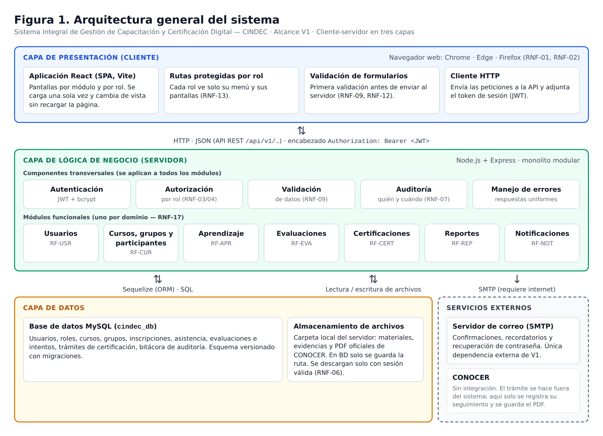
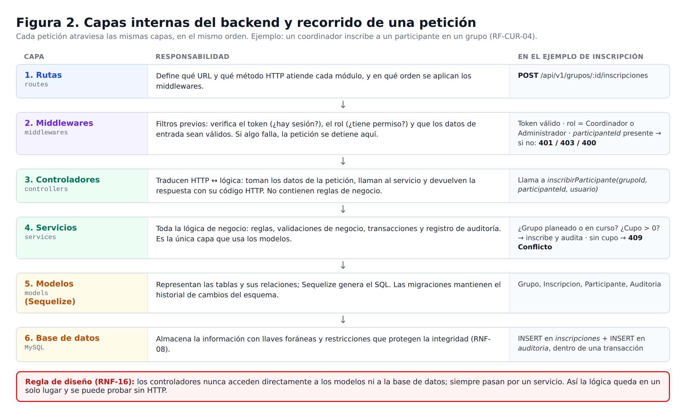
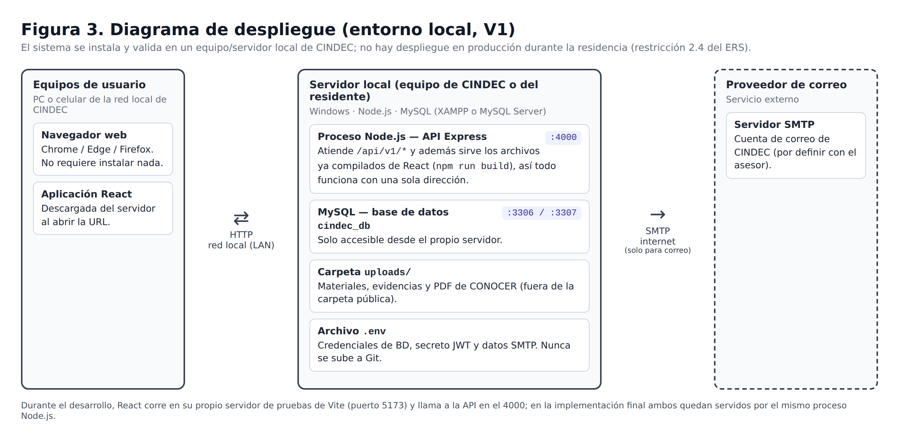

# 01 — Diseño de la arquitectura del sistema

> Fase: **Diseño del Sistema** (semanas 39-41) · Actividad 1 del cronograma: *Diseño de la arquitectura del sistema*.
> Base: `docs/01-requerimientos/ERS-CINDEC.docx` (v1.1) y `requerimientos.md`. Decisiones relacionadas: ADR-0001 (stack), ADR-0002 (alcance V1), ADR-0003 (estilo arquitectónico).
> Estado: **aprobado por el residente** (2026-10-01).

## 1. Propósito

Este documento define cómo se organiza internamente el sistema: en qué capas se divide, qué componentes tiene cada capa, cómo se comunican entre sí y cómo se instala en el entorno local de CINDEC. Es la base de los siguientes pasos del diseño (modelo entidad-relación, base de datos, UML y prototipos) y de la fase de Desarrollo.

## 2. Estilo arquitectónico

| Decisión | Elección | Por qué |
|---|---|---|
| Modelo general | **Cliente-servidor en tres capas**: presentación, lógica de negocio, datos | Separa la interfaz, las reglas y los datos (RNF-16) y es el modelo natural de una aplicación web. |
| Tipo de frontend | **SPA** (Single Page Application) con React | La interfaz cambia de vista sin recargar la página y consume la API por HTTP/JSON. |
| Comunicación | **API REST** con JSON | Estándar de la industria, independiente del frontend; la API puede servir después a otros clientes (p. ej. un portal empresarial, visión futura). |
| Organización del backend | **Monolito modular**: una sola aplicación Express dividida en módulos por dominio | Un solo desarrollador, entorno local y tiempo de desarrollo acotado: los microservicios añadirían complejidad sin beneficio en V1. Los módulos separados permiten crecer sin reestructurar (RNF-17, RNF-19). Ver ADR-0003. |

## 3. Arquitectura general



### 3.1 Capa de presentación (cliente)

| Componente | Responsabilidad | RNF |
|---|---|---|
| Aplicación React (Vite) | Pantallas de cada módulo, agrupadas por rol. | RNF-01, RNF-02, RNF-11 |
| Rutas protegidas por rol | Muestran a cada rol solo su menú y sus pantallas. Es una comodidad visual: **la seguridad real la aplica el backend**. | RNF-13 |
| Validación de formularios | Primera validación (campos obligatorios, formatos) con mensajes claros antes de enviar. | RNF-09, RNF-12 |
| Cliente HTTP | Centraliza las llamadas a la API, adjunta el token JWT y maneja la sesión expirada (regresa al login). | RNF-03 |

### 3.2 Capa de lógica de negocio (servidor)

**Componentes transversales** (aplican a todos los módulos):

| Componente | Qué hace | RNF / RF |
|---|---|---|
| Autenticación | Inicio de sesión con correo y contraseña; contraseñas guardadas con hash bcrypt; emite un token JWT con tiempo de expiración configurable en `.env`. | RF-USR-05, RNF-05 |
| Autorización | Middleware que revisa el rol del usuario en cada petición protegida y responde **403** si no tiene permiso. La matriz rol × funcionalidad se define en el paso de UML (casos de uso). | RF-USR-03, RNF-03, RNF-04 |
| Validación | Valida los datos de entrada en el servidor (segunda validación, la que realmente protege la BD). | RNF-09 |
| Auditoría | Servicio común que registra usuario, fecha, acción y registro afectado en las operaciones sensibles (usuarios, evaluaciones, certificaciones). | RF-USR-04, RNF-07 |
| Manejo de errores | Middleware final que convierte cualquier error en una respuesta JSON uniforme con su código HTTP. | RNF-12 |
| Recuperación de contraseña | Token de un solo uso con expiración, enviado por correo. | RF-USR-06 |

**Módulos funcionales** (uno por dominio del ERS):

| Módulo | Requerimientos | Depende de |
|---|---|---|
| Usuarios | RF-USR-01 a 06 | Notificaciones (recuperación de contraseña) |
| Cursos, grupos y participantes | RF-CUR-01 a 10 | Usuarios |
| Aprendizaje | RF-APR-01 a 03 | Cursos; almacenamiento de archivos |
| Evaluaciones | RF-EVA-01 a 05 | Cursos/grupos; almacenamiento de archivos (evidencias) |
| Certificaciones | RF-CERT-01 a 07 | Evaluaciones (resultado "competente"); almacenamiento de archivos (PDF de CONOCER) |
| Reportes | RF-REP-01 y 02 | Solo **lee** datos de los demás módulos; no modifica nada |
| Notificaciones | RF-NOT-01 | Servidor SMTP |

Regla de dependencias: un módulo usa a otro **a través de su servicio**, nunca leyendo directamente sus tablas por su cuenta. Así cada regla de negocio vive en un solo lugar.

### 3.3 Capa de datos

| Componente | Descripción |
|---|---|
| MySQL (`cindec_db`) | Toda la información estructurada. El esquema se crea y modifica **solo mediante migraciones** de Sequelize (historial versionado en Git). El detalle de tablas se define en los pasos 2 y 3 (modelo E-R y diseño de BD). |
| Almacenamiento de archivos | Carpeta local `uploads/` del servidor, **fuera** de la carpeta pública. En la BD solo se guarda la ruta y los metadatos (nombre original, tipo, tamaño, quién lo subió). Los archivos se descargan mediante un endpoint que verifica sesión y permiso (RNF-06). |

### 3.4 Servicios externos

- **Servidor SMTP** (proveedor de correo): única dependencia externa de V1; solo para notificaciones y recuperación de contraseña. Si no hay internet, el sistema sigue funcionando y únicamente falla el envío de correos (se registra el error, no se bloquea la operación).
- **CONOCER**: no hay integración técnica. El trámite se realiza fuera del sistema; aquí solo se registra su seguimiento y se resguarda el PDF oficial (ERS 2.4).

## 4. Arquitectura interna del backend



Cada petición recorre siempre: **rutas → middlewares → controlador → servicio → modelo → MySQL**.

**Regla de diseño (RNF-16, verificable):** los controladores no importan modelos ni acceden a la base de datos; toda operación de datos pasa por un servicio.

### 4.1 Estructura de carpetas propuesta (backend)

Se propone pasar de la estructura actual "por tipo de archivo" a una estructura **por módulo**, de modo que todo lo de un dominio quede junto (RNF-17). Los modelos se mantienen centralizados porque Sequelize necesita declarar las relaciones entre todos ellos en un solo lugar.

```
backend/
├── src/
│   ├── app.js                  # configuración de Express (middlewares globales, rutas, errores)
│   ├── server.js               # arranque del servidor
│   ├── config/                 # conexión a BD, lectura de .env
│   ├── middlewares/            # autenticar, autorizar(roles), validar, manejarErrores, subirArchivo
│   ├── models/                 # modelos Sequelize + index.js con las relaciones
│   ├── shared/                 # utilidades comunes: auditoría, correo, almacenamiento de archivos
│   ├── modules/
│   │   ├── usuarios/           # usuarios.routes.js · usuarios.controller.js · usuarios.service.js · usuarios.validators.js
│   │   ├── cursos/             # cursos, grupos, inscripciones, asistencia, instructores/evaluadores
│   │   ├── aprendizaje/
│   │   ├── evaluaciones/
│   │   ├── certificaciones/
│   │   ├── reportes/
│   │   └── notificaciones/
│   └── routes/index.js         # monta cada módulo bajo /api/v1/<módulo>
├── database/
│   ├── migrations/
│   └── seeders/                # roles base y usuario administrador inicial
└── uploads/                    # archivos subidos (excluido de Git)
```

> La reorganización de carpetas se aplica al iniciar la fase de Desarrollo (semana 41); hoy las carpetas `controllers/` y `services/` están vacías, así que el cambio no afecta código existente.

### 4.2 Convenciones de la API REST

| Aspecto | Convención |
|---|---|
| Prefijo | `/api/v1/` (la versión permite cambios futuros sin romper clientes) |
| Recursos | Sustantivos en plural: `/usuarios`, `/cursos`, `/grupos`, `/evaluaciones`, `/certificaciones`, `/reportes` |
| Métodos | `GET` consultar · `POST` crear · `PUT/PATCH` modificar · `DELETE` eliminar o desactivar |
| Formato | JSON en peticiones y respuestas; archivos con `multipart/form-data` |
| Autenticación | Encabezado `Authorization: Bearer <token>` en toda ruta protegida |
| Errores | Respuesta uniforme `{ "error": { "codigo": "...", "mensaje": "..." } }` |

Códigos HTTP usados: `200` correcto · `201` creado · `400` datos inválidos · `401` sin sesión · `403` sin permiso · `404` no existe · `409` conflicto de regla de negocio (p. ej. grupo sin cupo, RF-CUR-04) · `500` error interno.

Ejemplos (la lista completa de endpoints se define en Desarrollo, a partir de los casos de uso):

| Endpoint | RF |
|---|---|
| `POST /api/v1/auth/login` | RF-USR-05 |
| `POST /api/v1/grupos/:id/inscripciones` | RF-CUR-04 |
| `POST /api/v1/evaluaciones/:id/intentos` | RF-EVA-02, RF-EVA-04 |
| `PATCH /api/v1/certificaciones/:id/estatus` | RF-CERT-02 |
| `GET /api/v1/reportes/certificaciones?formato=xlsx` | RF-REP-01, RF-REP-02 |

## 5. Arquitectura del frontend

```
frontend/src/
├── api/            # cliente HTTP y una función por endpoint
├── auth/           # contexto de sesión, guarda de rutas por rol
├── layouts/        # estructura común (menú lateral por rol, encabezado)
├── pages/          # una carpeta por módulo: usuarios/, cursos/, aprendizaje/, evaluaciones/, certificaciones/, reportes/
├── components/     # componentes reutilizables (tablas, formularios, mensajes)
└── main.jsx        # punto de entrada, rutas
```

El detalle visual de cada pantalla se define en el paso 5 (prototipos).

## 6. Despliegue (entorno local)



- **Desarrollo:** React corre en el servidor de pruebas de Vite (puerto 5173) y llama a la API en el puerto 4000.
- **Implementación en CINDEC:** se compila React (`npm run build`) y Express sirve esos archivos junto con la API, de modo que el sistema queda en un solo proceso y una sola dirección en la red local.
- MySQL solo acepta conexiones desde el propio servidor. Las credenciales, el secreto JWT y los datos SMTP viven en `.env`, que nunca se sube a Git.

## 7. Trazabilidad: requerimientos no funcionales → decisiones de arquitectura

| RNF | Cómo lo atiende la arquitectura |
|---|---|
| RNF-01, 02 | Aplicación web SPA; interfaz adaptable (se detalla en prototipos). |
| RNF-03, 04, 13 | JWT + middleware de autorización por rol en el backend; menús por rol en el frontend. |
| RNF-05 | Contraseñas con hash bcrypt. |
| RNF-06, 10 | Archivos fuera de la carpeta pública y descarga solo con permiso; modificaciones de evaluaciones/certificaciones restringidas por rol en el servicio. |
| RNF-07 | Servicio común de auditoría usado por los servicios de los módulos sensibles. |
| RNF-08 | Llaves foráneas y restricciones en MySQL; transacciones en operaciones de varios pasos. |
| RNF-09, 12 | Doble validación (frontend y backend) y respuesta de error uniforme. |
| RNF-14, 15 | Consultas a través del ORM con paginación en listados y solo los campos necesarios. |
| RNF-16 | Capas rutas → controlador → servicio → modelo; controladores sin acceso a BD. |
| RNF-17, 18, 19 | Carpeta por módulo; agregar un módulo = agregar una carpeta y montarla en `routes/index.js`. |
| RNF-20 | Esquema normalizado y migraciones (se detalla en el diseño de BD). |
| RNF-21 | La API versionada y los módulos separados permiten agregar después un portal multiempresa; el posible soporte de datos multiempresa se evalúa en el diseño de BD (paso 3), sin implementarlo en V1. |

## 8. Puntos a validar

- [ ] **Equipo servidor:** ¿en qué equipo de CINDEC se instalará la versión local para la validación (o se valida en el equipo del residente)? — preguntar a Juan Alexis.
- [ ] **Cuenta de correo SMTP:** ¿qué cuenta de CINDEC se usará para enviar notificaciones? Mientras tanto, en desarrollo se usa una cuenta de pruebas.
- [x] Revisión de este documento por el residente (aprobado 2026-10-01).
